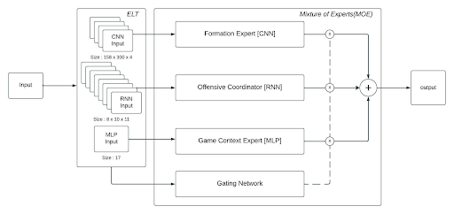
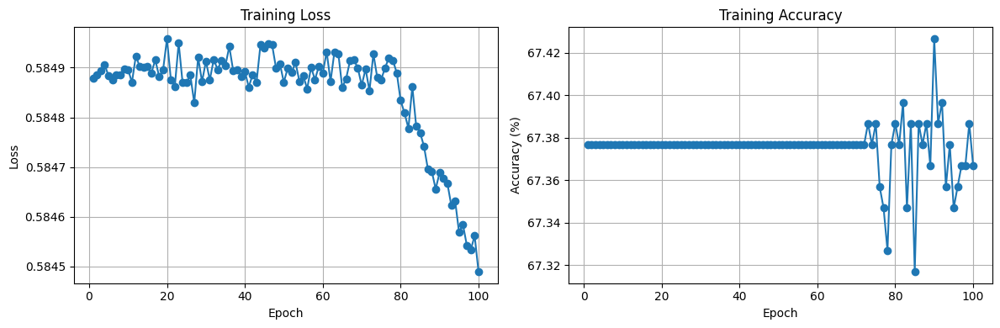
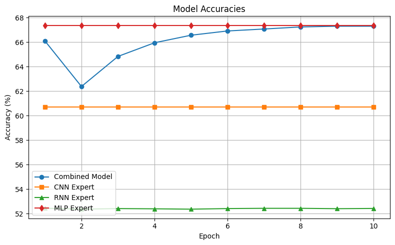

# NFL Play Prediction using Mixture of Experts

A deep learning system that predicts whether an NFL play will be a pass or run using pre-snap data. The model employs a Mixture of Experts (MoE) architecture combining predictions from specialized neural networks.

## Overview

This project analyzes NFL Big Data Bowl 2025 data using three expert models (CNN, RNN, MLP) combined through a gating network to predict play types. Each expert focuses on different aspects of the pre-snap formation:

- **[CNN Expert](experts/cnn.py)**: Analyzes spatial patterns in formation images
- **[RNN Expert](experts/rnn.py)**: Processes temporal sequences of player movements
- **[MLP Expert](experts/mlp.py)**: Evaluates game context features
- **[Gating Network](experts/gating_network.py)**: Learns to weight expert predictions optimally

## Quick Start
1. See [**Report**](reports/report.pdf) and [**Demos**](demos/) for detailed analysis and interactive demonstrations.
2. Get data and transform it into features using the ETL module (see [ETL Module](etl/README.md) for instructions)
3. Install dependencies: `pip install -r requirements.txt`
4. Train and evaluate the models

## Project Structure

### ETL Module
- [Documentation](etl/README.md)
- Handles data extraction, transformation, and loading
- Includes feature engineering pipelines to create datasets for each expert

### Experts Module
- [Documentation](experts/README.md)
- Implements individual expert models and gating network
- Contains model architectures and training logic

### Demo Notebooks
- Training individual experts:
  - [CNN Training](demo/trainCNN.ipynb)
  - [RNN Training](demo/trainRNN.ipynb)
  - [MLP Training](demo/trainMLP.ipynb)
- [MoE Training](demo/trainMoE.ipynb)

## Training Process

1. Train individual experts separately
2. Freeze expert weights
3. Train gating network
4. Fine-tune entire system end-to-end

## Results

The figure above shows the training loss and accuracy of the MoE model over 100 epochs where the gating network is initialized with random weights and no L1 regularization. The model doesn't seem to learn until the 75th epoch. To rectify this, we can initialize the gating network to assign equal weights to the experts and use L1 regularization to encourage sparsity in the gating network.

---

The above plot illustrates the even when sparsity is encouraged in the MoE model, the model will converge to the best performing expert. This is because the gating network is not able to learn to weight the experts properly.