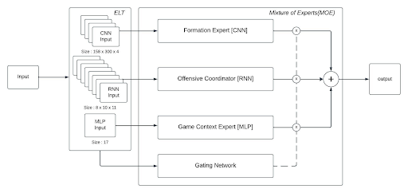

# Experts Module

This module implements the individual expert models and gating network for a Mixture of Experts (MoE) architecture. The MoE model combines predictions from three different neural network architectures (CNN, MLP, RNN) using a learned gating network to weight their individual predictions.

## Architecture Overview

The experts module consists of four main components:

1. **Multi-Layer Perceptron (MLP)** - A feedforward neural network with three hidden layers
2. **Convolutional Neural Network (CNN)** - For processing spatial patterns in the play data
3. **Recurrent Neural Network (RNN)** - An LSTM-based network for temporal patterns
4. **Gating Network** - Learns to weight predictions from each expert based on their performance

### Expert Models

#### MLP Expert
- Architecture: 3 hidden layers (50 neurons each) with ReLU activation
- Input: Flattened feature vector
- Output: Binary classification (play success probability)
- Training: SGD with cross-entropy loss

#### RNN Expert (LSTM)
- Architecture: 2-layer LSTM with 128 hidden units
- Input: Sequence of player positions and features
- Output: Binary classification
- Features: Processes temporal patterns in player movements

#### CNN Expert
- Specialized in processing spatial patterns
- Input: Grid-based representation of player positions
- Output: Play success probability

### Gating Network
- Takes predictions from all experts as input
- Outputs weights for combining expert predictions
- Trained to optimize the overall ensemble performance

## Usage
